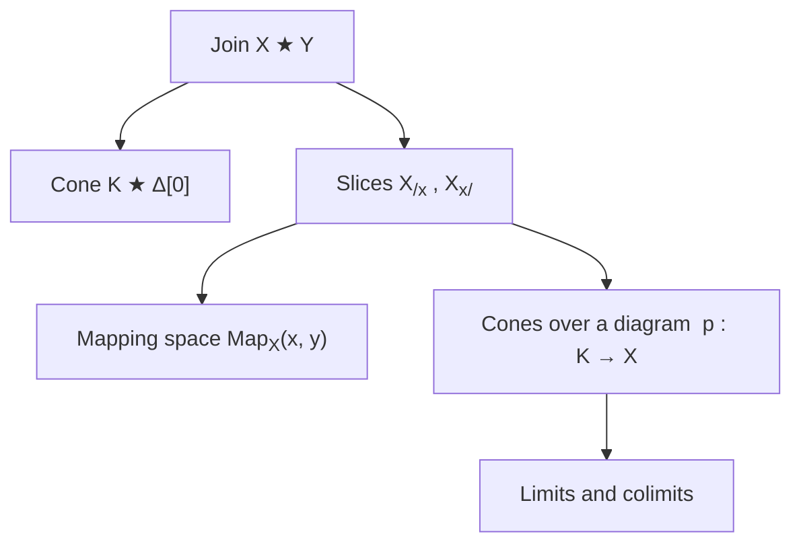
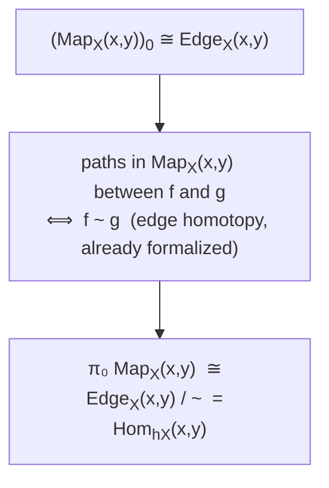
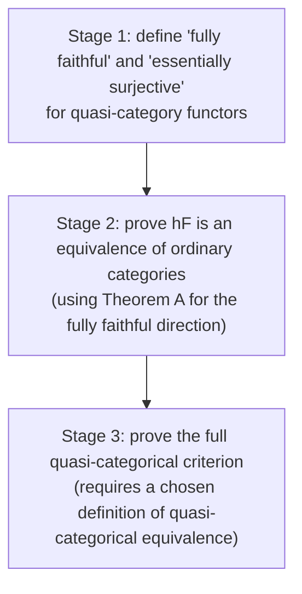
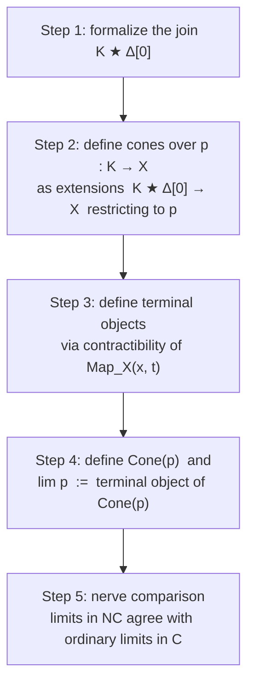
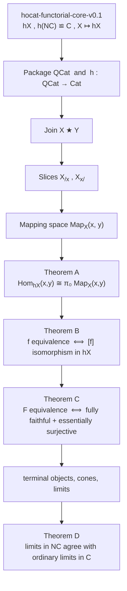

# What Comes Next: Mapping Spaces, Equivalences, and Limits

> **What this is (please read first).** This is a companion document to the walkthrough of
> `hocat-functorial-core-v0.1`. That walkthrough described what was built: edge homotopy, the
> homotopy category `hX`, functoriality of `X ↦ hX`, and the recovery `h(N C) ≌ C`. This document
> describes what I think should come next, in the same exploratory spirit.
>
> I want to be clear about what kind of document this is. It is not a plan I am committed to.
> It is not a claim that these are the deepest or most original theorems to aim for. It is closer
> to "from what I have read and gathered, here are what I understand to be central constructions
> in `(∞,1)`-categories, and here are the results they lead toward, which seem like natural
> next steps for this project." If I have the dependencies wrong, or if there is a better order,
> I welcome corrections.
>
> The epistemic status of the sentences below varies. Where I say "this is standard" I mean it
> appears in Lurie's *Higher Topos Theory* or Joyal's foundational notes and I believe it. Where
> I say "I think" or "it seems like", I mean I am working from partial understanding and could
> easily be wrong about the difficulty or the details.

*Where things stand as I write this: the development is tagged `hocat-functorial-core-v0.1`.
The four theorems from the walkthrough are fully checked with no `sorry`. The next layer will
require new infrastructure, specifically joins, slices, and mapping spaces, that the current
files do not yet touch.*

---

## Table of contents

0. [What the current checkpoint gives, and what it does not](#0-what-the-current-checkpoint-gives-and-what-it-does-not)
1. [The central missing piece: mapping spaces](#1-the-central-missing-piece-mapping-spaces)
2. [The construction that unlocks mapping spaces: joins and slices](#2-the-construction-that-unlocks-mapping-spaces-joins-and-slices)
3. [Four theorems I would like to reach](#3-four-theorems-i-would-like-to-reach)
4. [A rough dependency picture](#4-a-rough-dependency-picture)
5. [Some honest notes on difficulty](#5-some-honest-notes-on-difficulty)

---

## 0. What the current checkpoint gives, and what it does not

The functorial core does one thing well: it extracts an ordinary category `hX` from a
quasi-category `X`, proves that this extraction is functorial, and verifies that it recovers
ordinary categories from their nerves.

What it does not do is say anything about the *higher structure* of `X` that `hX` forgets.
The homotopy category `hX` records only whether two edges are homotopic; it throws away
everything about *how many ways* they can be homotopic, and what those ways look like. The
whole point of `(∞,1)`-category theory is that this forgotten information matters. So the
functorial core is, in some sense, a foundation for the interesting questions rather than an
answer to them.

The central object that captures the forgotten structure is the **mapping space** `Map_X(x, y)`.
The rough idea is: instead of a set of morphisms from `x` to `y`, there is a whole *space* of
them, and the homotopy classes of that space are exactly the morphisms of `hX`. The connection
between `hX` and mapping spaces is the first theorem I would like to reach.

---

## 1. The central missing piece: mapping spaces

The homotopy category `hX` has, as its hom-set from `x` to `y`, the set of homotopy classes
of edges:

```math
\operatorname{Hom}_{hX}(x,y) = \{f : x \to y\} \big/ {\sim}.
```

The mapping space `Map_X(x, y)` is the richer object whose set of connected components
recovers that hom-set. Concretely, the `0`-simplices of `Map_X(x, y)` are the edges `f : x → y`
in `X`, and paths between two `0`-simplices in `Map_X(x, y)` correspond to edge homotopies. So

```math
\pi_0 \operatorname{Map}_X(x,y) \cong \operatorname{Hom}_{hX}(x,y).
```

I find this a satisfying statement because it makes precise what `hX` forgets: it forgets all
of `Map_X(x, y)` except its set of connected components.

There are several equivalent ways to define `Map_X(x, y)` formally. The one most natural for
the rest of the theory uses the join construction, which I describe in the next section. A
simpler but less general approach constructs the mapping space directly from the edges and
homotopies already formalized in the current codebase, and that might be the right starting
point for the Lean development before committing to the full join.

> *Note to self.* The fact that there are "several equivalent definitions" of mapping spaces
> was confusing to me at first. The equivalences between the definitions are themselves
> nontrivial theorems, not obvious by inspection. For the purpose of getting the Lean
> formalization off the ground, the pragmatic question is: which definition requires the least
> new infrastructure to define, while still being strong enough to prove the theorems I care about?
> I do not yet have a confident answer. It seems like a join-free definition is enough for the
> first theorem below, but the join-based one is necessary for the later ones.

---

## 2. The construction that unlocks mapping spaces: joins and slices

From what I have gathered, the join `X ★ Y` of two simplicial sets is not just one convenient
construction among many. It is the gateway to most of the higher structure in `(∞,1)`-category
theory. Mapping spaces, cone categories, limits, and several important fibration conditions all
pass through it. I will describe the idea here without going into the formal definition.

The join `X ★ Y` should be thought of as "X followed by Y", with all possible edges from
simplices in `X` to simplices in `Y` thrown in. The simplest case is `K ★ Δ[0]`: this is the
cone over `K`, meaning `K` with a new vertex "on top" and an edge from every vertex of `K` to
that new vertex.

Slices come next. The **over-category** `X_{/x}` and the **under-category** `X_{x/}` are the
quasi-categorical analogues of comma categories. Their construction uses the join, and they are
the right setting for formulating cones over a diagram and, eventually, limits.



The dependency here is strict: mapping spaces (in their general form), slices, cones, and
limits all build on the join. So formalizing the join is not preparation work that can be
deferred; it is the first real construction in the next layer.

> *Note to self.* I initially thought of joins as a "later" topic that I could return to after
> doing mapping spaces a simpler way. Then I found that the simple approach to mapping spaces is
> not strong enough to prove the equivalence criterion (Theorem C below), and that slices really
> do require the join, not just an approximation. So the join has moved to the top of my list. I
> do not know yet how hard it is to formalize in Lean; the definition is combinatorially
> involved (simplices of `X ★ Y` are listed by cases depending on which summand they come from)
> and I expect the face and degeneracy maps to take some work to get right.

---

## 3. Four theorems I would like to reach

Here are the four results that seem, to me, to form the natural next layer above the current
checkpoint. I am listing them in the order they depend on each other, not in the order I find
them most interesting.

---

### Theorem A: Hom-sets in `hX` are connected components of mapping spaces

```math
\operatorname{Hom}_{hX}(x,y) \cong \pi_0\operatorname{Map}_X(x,y).
```

**What it says.** This is the precise connection between the existing `hX` construction and the
mapping spaces introduced in the previous section. The hom-set in `hX` from `x` to `y` is
exactly the set of connected components of the mapping space `Map_X(x, y)`.

**Why it matters.** It explains `hX` correctly: not as an arbitrary shadow of `X`, but as
the `π₀`-shadow of the mapping-space structure. Every subsequent result about mapping spaces
can be "downstairs" checked against `hX` via this theorem.

**Proof idea.** The `0`-simplices of `Map_X(x, y)` are the edges from `x` to `y` in `X`,
which we already have as the `Edge` type. The paths between two `0`-simplices in `Map_X(x, y)`
are the `2`-simplex homotopies already formalized as `Homotopic`. So `π₀` of the mapping
space is exactly `Edge X x y` quotiented by `Homotopic`, which is already the definition of
`Hom_{hX}(x, y)`. The three steps that make this precise:



**Lean reuse.** This theorem gets to use almost everything already in the codebase: `Edge`,
`Homotopic`, `homotopySetoid`, and the full quotient infrastructure. The new piece is the
mapping-space simplicial set itself, and a definition of `π₀` (or at least a component-quotient)
for a simplicial set.

---

### Theorem B: Equivalence edges and isomorphisms in `hX`

```math
f : x \to y \text{ is an equivalence in } X
\quad\iff\quad
[f] \text{ is an isomorphism in } hX.
```

**What it says.** A higher-categorical equivalence between objects of `X` is exactly a morphism
that becomes an isomorphism when passed to `hX`.

**Why it matters.** This is one of the basic bridges between `X` and `hX`. It says that
equivalences, which live at the level of the higher structure, can be *detected* by the coarser
homotopy category.

**A subtlety worth flagging.** There are two ways to define "equivalence edge", and they give
statements of very different difficulty.

The first way defines it via `hX`: say `f` is an equivalence edge if there exists `g : y → x`
with `[g] ∘ [f] = [1_x]` and `[f] ∘ [g] = [1_y]` in `hX`. With this definition the theorem
above is almost tautological: it is just unpacking the definition. That is still worth
formalizing as a packaging result, but it is not yet the interesting direction.

The interesting version defines equivalence edges *internally* using `2`-simplices and horn
fillers, without reference to `hX`. Proving that the simplicial notion and the `hX` notion
agree is where the real content lies. The two directions of the proof look like:

```mermaid
flowchart TD
    subgraph fwd ["Forward direction"]
        A1["define IsEquivEdge via horn fillers"]
        B1["find inverse edge  g : y → x"]
        C1["construct homotopies\ng ∘ f ~ 1ₓ  and  f ∘ g ~ 1ᵧ"]
        D1["pass to hX:\n[g] ∘ [f] = [1ₓ]  and  [f] ∘ [g] = [1ᵧ]"]
        E1["[f] is an isomorphism in hX"]
        A1 --> B1 --> C1 --> D1 --> E1
    end

    subgraph bwd ["Backward direction"]
        A2["[f] is an isomorphism in hX"]
        B2["choose a representative g for [f]⁻¹"]
        C2["the class equations lift to homotopies in X"]
        D2["f is an equivalence edge in the simplicial sense"]
        A2 --> B2 --> C2 --> D2
    end
```



**Lean reuse.** `SSet.HoCat.comp`, `leftUnit`, `rightUnit`, `associativity`,
`Quotient.sound`, `compRep`, and quotient induction all apply here. The new piece is a
formal definition of `IsEquivEdge` at the simplicial level, which will require some
horn-filling infrastructure similar to (but more involved than) what the current codebase
already uses for homotopy.

---

### Theorem C: A functor is an equivalence iff it is fully faithful and essentially surjective

```math
F : X \to Y \text{ is an equivalence}
\quad\iff\quad
F \text{ is fully faithful and essentially surjective.}
```

**What it says.** The classical criterion for an equivalence of ordinary categories lifts to
quasi-categories. Essential surjectivity is the condition on `hF : hX → hY` that we can
already express. Full faithfulness is a mapping-space condition: the induced map

```math
\operatorname{Map}_X(x, x') \longrightarrow \operatorname{Map}_Y(Fx, Fx')
```

should be an equivalence of spaces for every `x, x'`.

**Why it matters.** This is one of the central results in `(∞,1)`-category theory. It makes
the criterion for equivalence checkable: instead of constructing a homotopy inverse directly
(which is hard), one checks two separate conditions that are each closer to ordinary
category theory.

**How it connects to the current codebase.** The current `SSet.HoCat.map` functor already
gives us `hF : hX → hY` for any simplicial map `F : X → Y`. So essential surjectivity can
be stated right now, in terms of the already-formalized `hF`. Full faithfulness cannot yet
be stated because we do not have mapping spaces yet.

**A staging suggestion.** Rather than attempting the full theorem immediately, there is a
useful intermediate result: if `F` is fully faithful and essentially surjective in the above
senses, then `hF : hX → hY` is an equivalence of ordinary categories. The argument uses
Theorem A: full faithfulness on mapping spaces implies full faithfulness on `π₀`, and then
ordinary category theory packages the conclusion.



> *Note to self.* Stage 3 is the one where I am least confident about what the right Lean
> approach is, because it requires committing to a definition of "equivalence of quasi-categories"
> before proving the theorem. One reasonable strategy is to *define* equivalence as "fully
> faithful and essentially surjective" for the time being, then later prove this agrees with
> other natural definitions. That would make Stage 3 empty by definition, and the real work
> would be in showing the definition is well-posed and agrees with what you expect. I note this
> here as a design choice to decide, not a settled plan.

**Lean reuse.** `SSet.HoCat.map`, `nerveHoCatFunctor`, and the existing `Full`, `Faithful`,
`EssSurj`, `IsEquivalence` machinery in Mathlib's category theory library. In fact, the
strategy of "prove full + faithful + essentially surjective and let the library build the
equivalence" was already used successfully in the current codebase for `nerveHoCatIso`. The
same approach should work here.

---

### Theorem D: Limits are terminal objects in quasi-categories of cones

For a diagram `p : K → X`, a **limit** of `p` is a terminal object in the quasi-category of
cones over `p`.

**What it says.** The `(∞,1)`-categorical universal property of a limit is not "a unique arrow
to every cone" but rather "a *contractible space* of choices". A terminal object `t` in `X`
is one where `Map_X(x, t)` is contractible for every `x`. A limit is a terminal cone.

**Why it matters.** This is one of the organizing ideas of the whole theory. It is how the
theory avoids demanding strict uniqueness (which is unnatural homotopically) while still
capturing the correct universal property.

**The cone construction.** A cone over `p : K → X` with vertex `v` is a map

```math
K \mathbin{\star} \Delta^0 \longrightarrow X
```

whose restriction to `K` is `p`. The quasi-category of all such cones, `Cone(p)`, is defined
using the mapping object and the join. The limit of `p` is then defined to be a terminal
object of `Cone(p)`.



Step 5 is the `(∞,1)`-categorical analogue of `h(N C) ≌ C`. It is the verification that the
quasi-categorical definition recovers ordinary limit theory, just as `h(N C) ≌ C` verified
that the quasi-categorical homotopy category recovers ordinary categories. I think of it as a
necessary sanity check on the whole development.

> *Note to self.* Step 1 is probably the hardest single piece. The combinatorics of `X ★ Y`
> require defining the simplices case by case (a `k`-simplex of `X ★ Y` is either a simplex
> of `X`, or a simplex of `Y`, or a pair of simplices one from each, joined by a "middle edge")
> and getting the face and degeneracy maps right across all the cases. I expect this is where
> most of the time in the next phase of the project will be spent. But I also think it is a
> good single target: once the join is in place, a lot of the subsequent constructions follow
> fairly naturally.

**Lean reuse.** The nerve comparison in Step 5 uses the existing `nerveHoCatIso` result and
the functoriality infrastructure. The structure of the argument should be similar to what was
done for `h(N C) ≌ C`: identify the objects on both sides, construct the comparison map,
and prove it is fully faithful and essentially surjective.

---

## 4. A rough dependency picture

Here is the order I currently think these things depend on each other.



A few things to note about this picture. First, the join is not an independent construction
that lives off to the side; it is load-bearing for almost everything above Theorem A. Second,
Theorems A and B are close together in difficulty and probably should be developed in parallel.
Third, Theorem C has a useful intermediate form (the "shadow theorem" about `hF`) that can be
proved before the full quasi-categorical criterion is in reach. Fourth, Theorem D is the most
ambitious and should come last.

---

## 5. Some honest notes on difficulty

I want to record where I think the difficulty actually lies, partly so my future self remembers
what the traps are, and partly because some of these are things I currently do not know how to
do and am treating as open problems for myself.

**The join is combinatorially demanding.** The definition of `X ★ Y` as a simplicial set
requires specifying simplices in three cases (from `X`, from `Y`, or straddling both) and
getting the face and degeneracy maps right for each. I have not done this yet. I do not know
how much of this is already in Mathlib. If it is, the development should be much easier. If it
is not, formalizing the join from scratch will probably be the biggest single piece of work in
the next phase.

**Theorem B requires a simplicial definition of equivalence.** As I described above, there are
two versions of Theorem B, and the easy one is tautological. The genuinely nontrivial version
requires a definition of equivalence edge using `2`-simplices and horn fillers, independent of
`hX`. I believe this is the right definition and the theorem is true, but I am not confident
about the Lean proof difficulty.

**Theorem C requires choosing a definition of quasi-categorical equivalence.** This is more
of a design question than a mathematical one, but it is one I will need to resolve. The two
natural choices are: define it via the Joyal model structure (which may be in Mathlib), or
define it as "fully faithful and essentially surjective" and later check compatibility. I lean
toward the second for pragmatic reasons, but I note this as an unresolved point.

**Theorem D (Step 5) is the one I am least sure about.** The nerve comparison for limits
requires, among other things, comparing `N(J ★ 1)` with `NJ ★ Δ[0]`, which is a nontrivial
property of the join construction. I am flagging this here because the original walkthrough
describes `h(N C) ≌ C` as taking substantial work to formalize, and I expect Step 5 to be
at least comparable in difficulty.

**What I am most confident about.** Theorem A, once mapping spaces are defined, should follow
fairly directly from what is already in the codebase: the `0`-simplices and paths are already
the right objects, and the quotient machinery is already there. I think this is the most
accessible of the four theorems, and the right first target after the join.

---

*This document will be updated as the project develops. As before: read the confident-sounding
sentences as "this is what I currently believe," not "this is settled." Corrections and
suggestions are welcome.*
